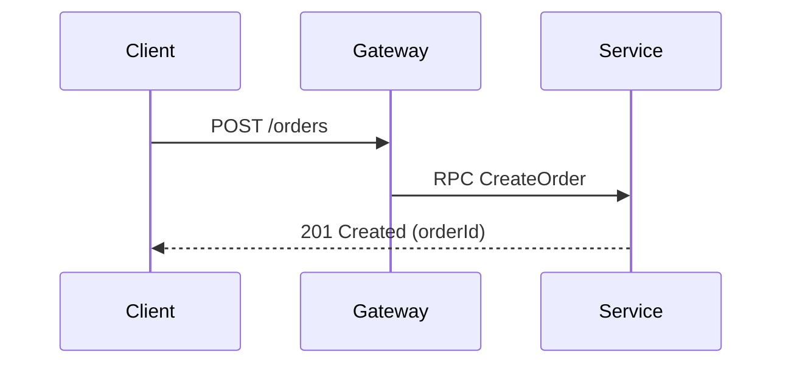

帮助用户以直观的可视化方式理解当前技术主题。省略寒暄，保持叙述凝练，选取能讲清核心主线的最小视图。

## 代码结构与架构形态 (核心主视觉)

- **算法与业务逻辑（伪代码）**：用缩进文本展现分支与算法步骤，省略冗余语法：
```text
on(save)
  if content is unchanged
    return cached result
  write new content
  invalidate cache
  return fresh result
```

- **运行时控制流（调用树）**：用树形连接符清晰体现层级归属与调用栈：
```text
submitForm
├── createSession
│   ├── persistPrompt
│   └── launchAgent
└── navigateToSession
    └── subscribeToEvents
```

- **UI 结构与状态边界（组件树）**：标注组件层级、文件归属与核心 Hook/状态：
```tsx
<SessionPage> (apps/example/src/routes/session.tsx)
  useSessionEvents()
  <SessionToolbar>
    <RunSkillButton> (packages/ui)
  <SessionTimeline>
    <SkillResultCard>
```

- **模块职责与目录边界（浅层文件树）**：仅列关键文件并标注职责注释：
```text
src/
├── commands/       # 解析并扩展用户指令
├── sessions/       # 负责会话生命周期与状态持久化
└── transport/      # 底层 API 与 SSE 流式通信
```

- **实体交互与数据流转（Mermaid）**：用轻量 Mermaid 表达交互时序或数据流：


- **局部增量演进（Diff 模式）**：用 `+` / `-` 聚焦改动点，形态精准匹配主题（组件、目录树、调用栈或状态变更）：
```diff
 <SessionToolbar>
+  <RunSkillButton />
```

- **完整实现（代码块）**：仅在全新实现或用户需要完整可复制内容时展示。

- **表达指导准则**：
  - **真实数据与文案**：使用真实业务标签、函数名与数据，杜绝 `foo`/`bar`/`Lorem ipsum` 占位符。
  - **适度克制**：聚焦当前核心矛盾，选取最匹配的 1~3 种形态，切忌堆砌造成认知过载。

## 交付形态决策

根据场景复杂度与沟通深度或用户需求，选择最合适的展现介质：

- **终端文本形态**：
  - **适用场景**：快速解释局部逻辑、函数调用流、组件层级、代码差异、或轻量 Mermaid 流程图。
  - **交付方式**：直接在对话回复中输出代码块，轻量高效，无需生成额外文件。
- **独立 HTML 页面形态**：
  - **适用场景**：复杂跨端/跨系统架构全景、多实体复杂时序与状态流转、UI 结构与视觉演进对比、大型工程迁移与重构方案、或需要交付给用户保存与沉淀的完整设计。
  - **交付方式**：读取 [`assets/template-show-me.html`](assets/template-show-me.html) 填充生成自包含单文件（设计规范与布局约束详见模板内注释），用合适的方式向用户展示，并在对话中附带文件链接与核心结论。

## 场景化图表与 UI 视觉化

根据技术主题选择合适的辅助呈现方式：

- **专业图表路由（以规范内联 SVG 呈现，参考 [`references/`](references/)）**：
  - **跨端适配与分层拓扑**：[`references/type-architecture.md`](references/type-architecture.md)（区域分组、正交圆角折线、跳线）
  - **多实体时序交互**：[`references/type-sequence.md`](references/type-sequence.md)（生命线、激活条、分支框）
  - **状态机与生命周期**：[`references/type-state.md`](references/type-state.md)（起止圆、状态卡片、跃迁事件与守卫）
  - **逻辑分支与流程**：[`references/type-flowchart.md`](references/type-flowchart.md)（形状承载语义、正交分支）
  - **管道数据流转**：[`references/type-data-flow.md`](references/type-data-flow.md)（横向角色泳道 × 纵向处理阶段）
  - **实体模型与表结构**：[`references/type-db-schema.md`](references/type-db-schema.md)（表卡片、字段约束、字段精准连线）
  - **无图模式**：纯代码逻辑或无复杂拓扑场景无需强行塞图，版面留给全宽代码与要点卡片。
  - **图元支持**：单色技术图标库 [`references/primitive-icons.md`](references/primitive-icons.md)，手写体图注 [`references/primitive-annotation.md`](references/primitive-annotation.md)。
- **UI 视觉化呈现**：前端排版、组件空间分布或界面重构前后对比（自由利用 HTML/CSS 或 SVG 呈现中性结构骨架，聚焦布局与改动点，避免复刻细节皮肤）。

## 执行工作流

1. **提炼核心**：识别核心矛盾与主线，确定代码形态与 1~2 处重点强调。
2. **选择形态**：简单/局部问题直接在对话中输出文本代码形态；复杂/全局方案决定生成 HTML 页面。
3. **生成与交付**：
   - 文本形态：直接在回复中呈现。
   - HTML 形态：读取模板并组装，运行 `python3 scripts/self_check.py <file>` 校验后打开展示。
